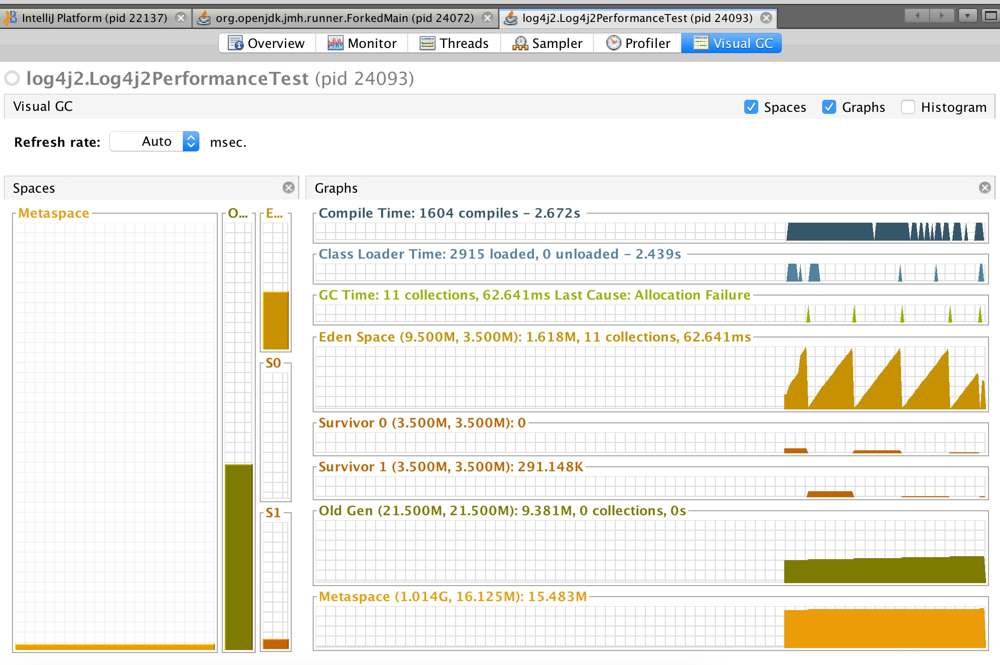
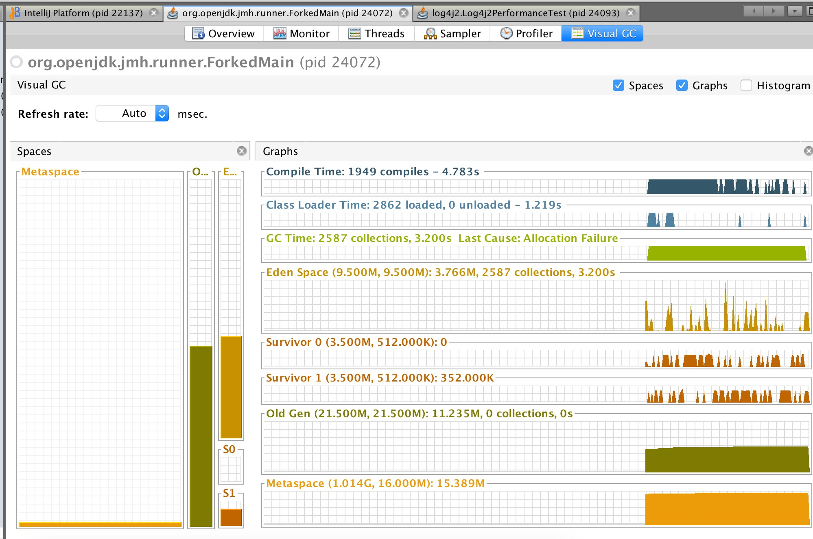

# log4j2性能测试

### 背景
本意是与logback的性能做下对比，于是顺带把log4j2的特性测了一遍
本次测试基于jmh做的
测试环境：
-   OS mac OS 10.13
-   JDK 1.8.0_181
-   CPU: 2.7 GHz Intel Core i5
-   memory: 8G
-   Log4j version:2.13.0
-   disruptor version: 3.4.2

### 关键字
性能测试、disruptor、garbage free

### 测试相关参数

运行需要加入vm参数：-DLog4jContextSelector=org.apache.logging.log4j.core.async.AsyncLoggerContextSelector 
-Dlog4j2.enable.threadlocals=true 
-Dlog4j2.enable.direct.encoders=true 
-Xms32m -Xmx32m

### logback VS log4j2 性能测试结果
TODO 待更新

### garbage free
先看看官方怎么介绍的garbage free的，开启后可减少gc回收，提高系统的吞吐

### garbage free 性能测试

通过visualVM查看，安装的visual-gc插件进行查看
测试方式：单线程不断打印日志，执行1分30秒左右，查看差距（测试吞吐的方式）
如图，2587次的gc和11次的gc(minor)比较，差距达到百倍

-   11 collections,consume 62ms

-   2587 collections,consume 3.2s

### 如何实现的
allocate temporary objects like log event objects, Strings, char arrays, byte arrays and more during steady state logging
官方原话，在输出日志过程中需要创建大量的临时对象，比如 log event（日志事件）
了解jvm的同学都知道，创建对象意味着在堆创建，堆内存通过gc回收；
于是log4j2的实现则将这些对象的属性保存到了ThreadLocal的一个map中，这样保证当方法栈执行完毕后，直接可随着栈回收

### 结论
-   打印的日志越大吞吐量越低
-   性能和线程的关系TODO 待测试
-   开启garbage free 可减少大量的gc回收，建议开启
-   性能方面log4j2 > logback > log4j1
-   输出日志parttern不配置类方法等信息，将会大幅提高吞吐（不再需要获取栈信息可提高性能）

### 相关文档地址
*   [jmh](http://openjdk.java.net/projects/code-tools/jmh/)
*   [garbagefree](http://logging.apache.org/log4j/2.x/manual/garbagefree.html)
*   [log4j2 async logger](http://logging.apache.org/log4j/2.x/manual/async.html)
*   [disruptor](https://github.com/LMAX-Exchange/disruptor/wiki/Introduction)