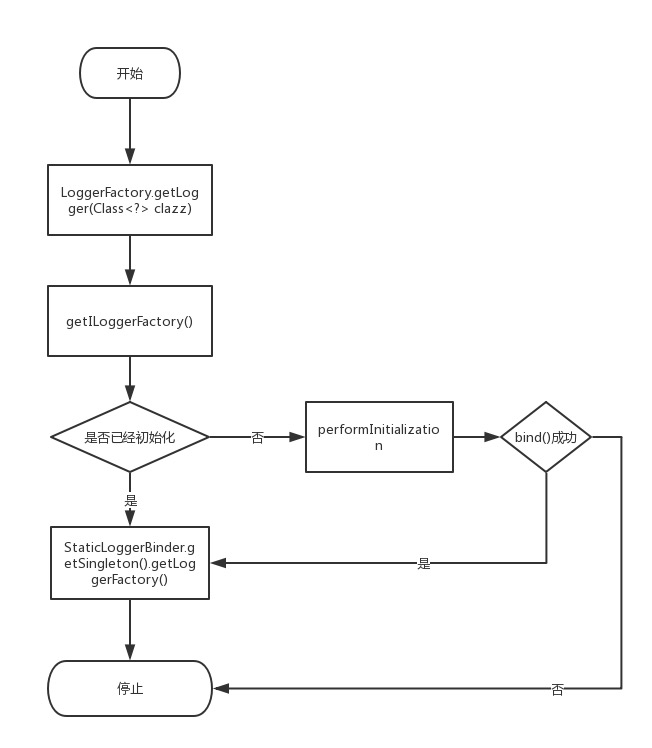
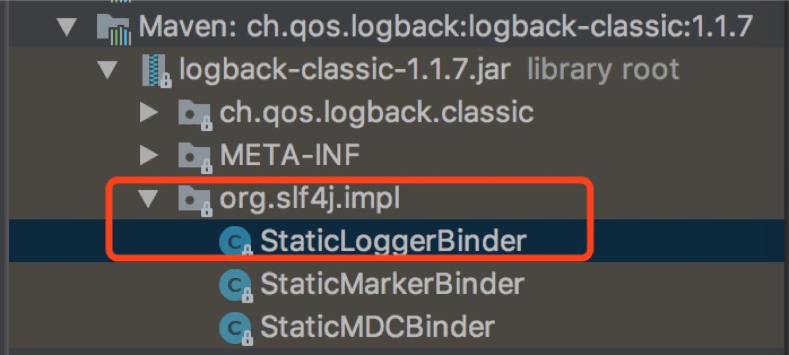
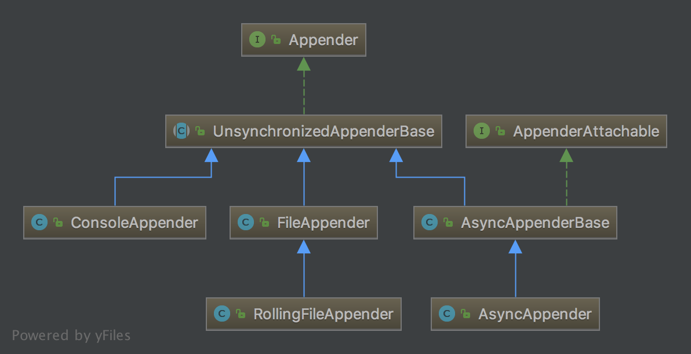

# logback

#### 背景
排查线上问题的过程中，现象是cpu居高不下，触发频繁的gc，在打印繁忙线程的执行栈时，有好几个线程都在执行日志输出
起初怀疑是配置的同步日志导致，后面确定配置的异步日志；在排查过程中也阅读了日志的相关源码，对它产生了好奇，于是
系统的阅读了logback的源码
#### 日志的前世今生（sl4j和其他的关系）
sl4j与其他日志组件的关系就好像jdbc和各个驱动厂商的关系，即sl4j定义了一套标准

#### sl4j如何定义标准的
从平时的代码说起 
    LoggerFactory.getLogger,让我们来看看getLogger做了什么
注：其中Logger和LoggerFactory都是slf4定义的接口和工厂


``` java
 public final class LoggerFactory {
    public static Logger getLogger(String name) {
        ILoggerFactory iLoggerFactory = getILoggerFactory();
        return iLoggerFactory.getLogger(name);
    }

    public static ILoggerFactory getILoggerFactory() {
        if (INITIALIZATION_STATE == UNINITIALIZED) {
            synchronized (LoggerFactory.class) {
                if (INITIALIZATION_STATE == UNINITIALIZED) {
                    INITIALIZATION_STATE = ONGOING_INITIALIZATION;
                    performInitialization();
                }
            }
        }
        switch (INITIALIZATION_STATE) {
        case SUCCESSFUL_INITIALIZATION:
            return StaticLoggerBinder.getSingleton().getLoggerFactory();
        case NOP_FALLBACK_INITIALIZATION:
            return NOP_FALLBACK_FACTORY;
        case FAILED_INITIALIZATION:
            throw new IllegalStateException(UNSUCCESSFUL_INIT_MSG);
        case ONGOING_INITIALIZATION:
            return SUBST_FACTORY;
        }
        throw new IllegalStateException("Unreachable code");
    }
    }
```

下图的bind方法就是扫描


那么问题来了，sl4j是如何找到的最终日志实现类呢，可以看到下图，没引入任何日志包时是这样的，


接着我们看下日志实现厂商logback的org.sl4j.impl下有一个这样的实现类



当然，当你引入多个日志实现时sl4j会扫描到报错，这也是使用日志过程中常见的错，可能有别的依赖包引入了其他的日志实现，需要手动的排除


#### Logback的执行过程
`filter`->`appender`->`encoder`->`layout`


让我们先来看看Logback中的Logger.info中最终调用的方法
``` java
private void filterAndLog_0_Or3Plus(final String localFQCN, final Marker marker, final Level level, final String msg, final Object[] params,
                final Throwable t) {
    //第一步：先执行过滤器
    final FilterReply decision = loggerContext.getTurboFilterChainDecision_0_3OrMore(marker, this, level, msg, params, t);


    if (decision == FilterReply.NEUTRAL) {
        if (effectiveLevelInt > level.levelInt) {
            return;
        }
    } else if (decision == FilterReply.DENY) {
        return;
    }
    //第二步：执行appender
    buildLoggingEventAndAppend(localFQCN, marker, level, msg, params, t);
}

```

#### 组件（appender，filter，layout）及介绍作用

TODO 需要一个大类图，展示他们的依赖关系
Logger依赖了filter及appender； appender依赖于layout

##### filter
TODO 默认开启哪些过滤器
主要做过滤器，官方提供了如下几个过滤器

过滤器分为两类，filter和turborFilter

filter
LevelFilter  
ThresholdFilter


-   DuplicateMessageFilter   用于检测重复的消息 维护了一个100长度的lru缓存，缓存打印的日志及次数，超过5次则丢弃
-   DynamicThresholdFilter  
-   MarkerFilter 用于验证日志请求中包含指定标识
-   MatchingFilter
-   MDCFilter
-   MDCValueLevelPair
-   ReconfigureOnChangeFilter 配置修改重配置过滤器
-   TurboFilter  所有过滤器的基类
##### appender


Logback delegates the task of writing a logging event to components called appenders
appender负责代理日志事件任务

类图

-   DBAppender 将日志信息输出到DB
-   ConsoleAppender 输出到控制台
-   FileAppender  输出到文件
-   AsyncAppender  异步日志
-   RollingFileAppender 日志自动切分


##### layout

layout 负责将event转换程最终要输出的日志格式
通过一个convert处理链，循环的执行替换其中关心的替换符
比如：DateConverter、ThreadConverter、MessageConverter等


##### asyncAppender 源码刨析
典型的生产者消费者模型，appender负责将事件发送到缓冲（队列，在Loback中采用ArrayBlockingQueue）
由一个线程（消费者）从缓冲中拿出并做后续的处理

让我们先看下async appender的一个配置
``` xml
 <appender name="ASYNC" class="ch.qos.logback.classic.AsyncAppender">

        <discardingThreshold>0</discardingThreshold>
        <includeCallerData>false</includeCallerData>
        <queueSize>512</queueSize>

</appender>
``` 

``` java
public class AsyncAppenderBase<E> extends UnsynchronizedAppenderBase<E> implements AppenderAttachable<E> {

    public static final int DEFAULT_QUEUE_SIZE = 256;
    int queueSize = DEFAULT_QUEUE_SIZE;
    
    @Override
    public void start() {
        // ....省略掉部分代码
        blockingQueue = new ArrayBlockingQueue<E>(queueSize);

        if (discardingThreshold == UNDEFINED)
            discardingThreshold = queueSize / 5;
        addInfo("Setting discardingThreshold to " + discardingThreshold);
        worker.setDaemon(true);
        worker.setName("AsyncAppender-Worker-" + getName());
        // make sure this instance is marked as "started" before staring the worker Thread
        super.start();
        
        //启动后初始化消费者
        worker.start();
    }

    @Override
    protected void append(E eventObject) {
        if (isQueueBelowDiscardingThreshold() && isDiscardable(eventObject)) {
            return;
        }
        preprocess(eventObject);
        put(eventObject);
    }
    
    //将日志放入队列
    private void put(E eventObject) {
        if (neverBlock) {
            blockingQueue.offer(eventObject);
        } else {
            putUninterruptibly(eventObject);
        }
    }
    
    class Worker extends Thread {
    
        public void run() {
            AsyncAppenderBase<E> parent = AsyncAppenderBase.this;
            AppenderAttachableImpl<E> aai = parent.aai;

            // loop while the parent is started
            while (parent.isStarted()) {
                try {
                    //不断的循环从队列中拿出进行处理
                    E e = parent.blockingQueue.take();
                    aai.appendLoopOnAppenders(e);
                } catch (InterruptedException ie) {
                    break;
                }
            }

            for (E e : parent.blockingQueue) {
                aai.appendLoopOnAppenders(e);
                parent.blockingQueue.remove(e);
            }

            aai.detachAndStopAllAppenders();
        }
    }
}
``` 

问题2：既然实现是ArrayBlockingQueue，如果队列满了如何处理（是否会丢日志）
``` java
//默认的策略是队列中容量还剩20%则会进行丢弃
if (discardingThreshold == UNDEFINED)
            discardingThreshold = queueSize / 5;

//判断是否超过            
private boolean isQueueBelowDiscardingThreshold() {
        return (blockingQueue.remainingCapacity() < discardingThreshold);
}

//什么级别的日志可丢弃，在实现中是TRACE, DEBUG , INFO
protected boolean isDiscardable(ILoggingEvent event) {
        Level level = event.getLevel();
        return level.toInt() <= Level.INFO_INT;
    }
    
protected void append(E eventObject) {
    if (isQueueBelowDiscardingThreshold() && isDiscardable(eventObject)) {
        return;
    }
    preprocess(eventObject);
    put(eventObject);
}
```

从阅读源码的过程中，还看到了一个配置项`includeCallerData`,那么这个参数是干什么的呢？
见源码分析可以看出，如果在日志中需要打印日志的行号、方法名等需要将这个属性开启，默认是关闭的状态
由于该参数会降低性能（显而易见，需要动态获取行号等需要消耗性能）
``` java
protected void preprocess(ILoggingEvent eventObject) {
        eventObject.prepareForDeferredProcessing();
        //如果开启，则调用getCallerData
        if (includeCallerData)
            eventObject.getCallerData();
    }
    
public interface ILoggingEvent {
    //接口返回的StackTraceElement的一个数组
    StackTraceElement[] getCallerData();
}

//从类的属性中可以看到，原来是保存 类名、方法名、执行行号的
public final class StackTraceElement implements java.io.Serializable {
    private String declaringClass;
    private String methodName;
    private String fileName;
    private int    lineNumber;
}  
         
```    

设置neverBlock为false，当队列满时出现阻塞
``` java
private void put(E eventObject) {
        if (neverBlock) {
            //风险：会有丢日志的风险，但能提高点性能
            blockingQueue.offer(eventObject);
        } else {
            putUninterruptibly(eventObject);
        }
    }
```

#### 其他特性（配置文件自动更新）
logback配置文件是可以动态更新的
使用场景：动态调整日志级别，便于追踪服务
1、配置方式
2、如何实现
ReconfigureOnChangeTask
简单说就是启一个定时器线程，根据配置间隔时间进行检测，检测配置文件的修改时间

``` java
void processScanAttrib(InterpretationContext ic, Attributes attributes) {
 ReconfigureOnChangeTask rocTask = new ReconfigureOnChangeTask();
 //开启一个定时任务，定时执行
 ScheduledFuture<?> scheduledFuture = scheduledExecutorService.scheduleAtFixedRate(rocTask, duration.getMilliseconds(), duration.getMilliseconds(),
                            TimeUnit.MILLISECONDS);
}

public class ReconfigureOnChangeTask implements Runnable {

     @Override
     public void run() {
         fireEnteredRunMethod();
         
         ConfigurationWatchList configurationWatchList = ConfigurationWatchListUtil.getConfigurationWatchList(context);
        
         //省略部分代码....
         if (mainConfigurationURL.toString().endsWith("xml")) {
             performXMLConfiguration(lc, mainConfigurationURL);
         }
     }
}
```  

#### 性能分析比较
TODO 需要测试下
#### appender源码分析比较（log4j=asyncAppender，logback=asyncAppender，log4j2=Disruptor）
#### 为什么disruptor更快
锁模型，传统的加锁 VS 乐观锁CAS
底层存储区别 RingBuffer VS ArrayBlockingQueue，两者都是固定长度，两者都是基于数组，但加锁的方式不同


//关联讲讲wangshu的代码实现
谈谈linkedBlockingQueue的缺点，即会发生大量待回收节点，需要频繁的gc


TODO 列一个表格，表示Ringbuffer和ArrayBlockingQueue的优缺点

#### 聊聊CPU
离cpu越远，容量越大，速度也越慢，价格也更便宜
寄存器->L0->L1->L2->L3->ROM(内存)->RAM(磁盘)
当CPU执行运算的时候，它先去L1查找所需的数据，再去L2，然后是L3，最后如果这些缓存中都没有，所需的数据就要去主内存拿。走得越远，运算耗费的时间就越长。所以如果你在做一些很频繁的事，你要确保数据在L1缓存中。

-   每核心都有一个自己的L1缓存。L1缓存分两种：L1指令缓存(L1-icache)和L1数据缓存(L1-dcache)。L1指令缓存用来存放已解码指令，L1数据缓存用来放访问非常频繁的数据。
-   L2缓存用来存放近期使用过的内存数据。更严格地说，存放的是很可能将来会被CPU使用的数据。
-   多数多核CPU的各核都各自拥有一个L2缓存，但也有多核共享L2缓存的设计。无论如何，L1是各核私有的(但对某核内的多线程是共享的)。


#### 缓存行填充
CPU为了提高读取数据的速度，会将数据缓存，在这边存储的单位为缓存行，
一个缓存行为64个字节(并不是所有，但大多数的CPU是)
一个Java的long类型是8字节，因此在一个缓存行中可以存8个long类型的变量。

``` java
//看看disuptor的类实现
abstract class RingBufferPad
{
    protected long p1, p2, p3, p4, p5, p6, p7;
}
```


#### 参考资料
http://logback.qos.ch/manual/architecture.html
http://logging.apache.org/log4j/2.x/manual/async.html
http://www.slf4j.org/codes.html#StaticLoggerBinder
https://github.com/LMAX-Exchange/disruptor
http://ifeve.com/disruptor-cacheline-padding/
http://ifeve.com/volatile/
http://ifeve.com/disruptor-memory-barrier/
http://ifeve.com/locks-are-bad/